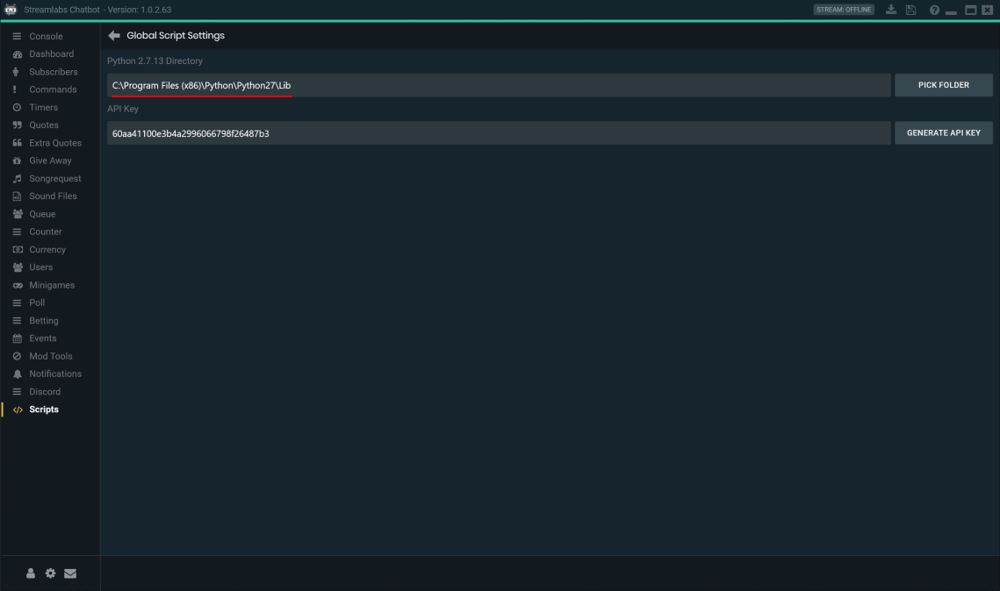

# Streamlabs-Chatbot-Scripts

This repository contains some useful Streamlabs Chatbot (SL Chatbot) scripts.

## Available scripts

| Name             | Description                                                                  | GitHub folder                                        | Download link                                                                                                                              | Latest version |
| ---------------- | ---------------------------------------------------------------------------- | ---------------------------------------------------- | ------------------------------------------------------------------------------------------------------------------------------------------ | -------------- |
| Template         | Basic boilerplate script to play with                                        | [Scripts/Template](Scripts/Template)                 | [Download latest version](https://github.com/Vasar007/Streamlabs-Chatbot-Scripts/raw/main/Releases/Latest%20versions/Template.zip)         | `1.0.0`        |
| Score            | Script that adds score counter between two opponents                         | [Scripts/Score](Scripts/Score)                       | [Download latest version](https://github.com/Vasar007/Streamlabs-Chatbot-Scripts/raw/main/Releases/Latest%20versions/Score.zip)            | `1.0.1`        |
| TransferCurrency | Script that allows viewers to transfer Streamlabs currency between eachother | [Scripts/TransferCurrency](Scripts/TransferCurrency) | [Download latest version](https://github.com/Vasar007/Streamlabs-Chatbot-Scripts/raw/main/Releases/Latest%20versions/TransferCurrency.zip) | `1.0.2`        |

## How to install any script

1. Download and install [Python 2.7.13 x86](https://www.python.org/ftp/python/2.7.13/python-2.7.13.msi) (x86 recommend by SL Chatbot team). Then go to "Scripts" -> "Settings" and specify Python directory.

   **Note:** you should specify not Python installation directory itself but `Lib` folder into it:

   
2. Download repository. You can download target script from [Releases](Releases) or with download links. In that case, go to the `step 5`.
3. Go to the target script directory (starting from the root where SCRIPT_StreamlabsSystem is located).
   Example: `Streamlabs-Chatbot-Scripts/Scripts/Score`
4. Create a ZIP archive for target script directory.
5. Open SL Chatbot, go to the "Script" tab, click "Import" and select ZIP archive with script directory.
6. If script will import successfully, you're good to go!
   Otherwise, check "Errors" and "Logs" tabs.

If you're having trouble with loading scripts in the SL Chatbot, see: [Scripts Explained video](youtube.com/watch?v=l3FBpY-0880)

Additional FAQ and known issues you can find here: [Streamlabs Support — Chatbot](https://github.com/StreamlabsSupport/Streamlabs-Chatbot)

## How to use

Enable script in your stream and have fun!

Notice that the script settings in SL Chatbot can be buggy so if you cannot change some settings, you can try to change it directly in config file (`*_config.py` which stores default values).

**Note:** prefer to reload script manually if you change any settings because SL Chatbot can skip settings reload for script sometimes!

## How to update any script

SL Chatbot can only replace file with the same names in script folder.
That means, some old files will remain in script folder.
In addition, settings file will remain as well which can lead to script initialization issues because of settings conflict.

So, I recommend to remove script folder if you want to safely update script.
However, in that case you lose script settings.
You can manually merge settings after update for example.
If you ensure that update process will not break script configuration, you can skip `step 1` and `step 2` in the instruction below.

1. Open SL Chatbot, go to the "Script" tab, click right mouse button and select "Open Script Folder".

   
2. Remove folder for script that you want to update.
3. Download new version of script. You can find how to download script in section [How to install any script](#how-to-install-any-script).
4. Open SL Chatbot, go to the "Script" tab, click "Import" and select ZIP archive with script directory.
5. If script will import successfully, you're good to go!
   Otherwise, check "Errors" and "Logs" tabs.

## Issues, bugs, ideas and etc

Feel free to [create new Issue](https://github.com/Vasar007/Streamlabs-Chatbot-Scripts/issues/new) or contact me directly (vasar007@yandex.ru) if you have any question or problems.

## License information

This project is licensed under the terms of the [Apache License 2.0](LICENSE).
